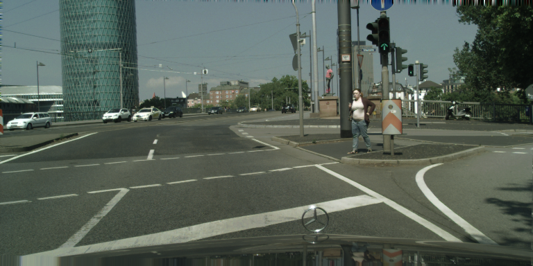
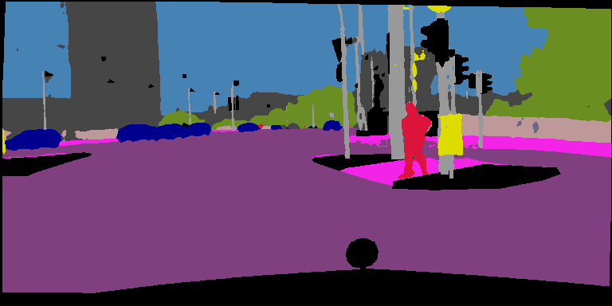
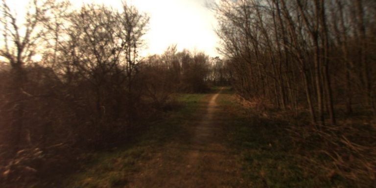
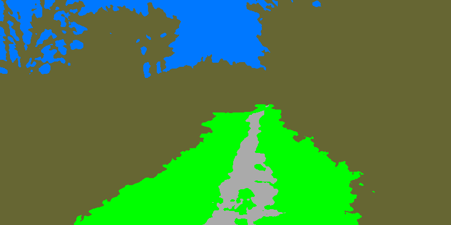
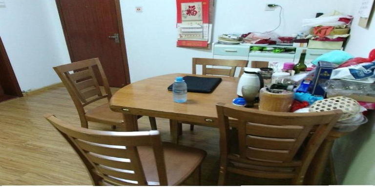
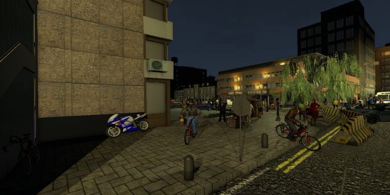
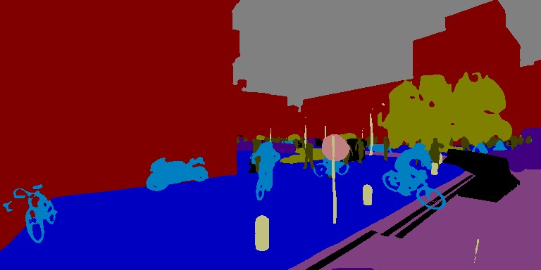
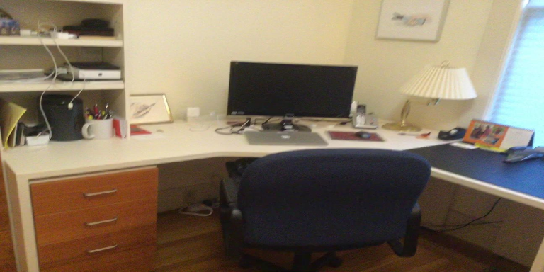
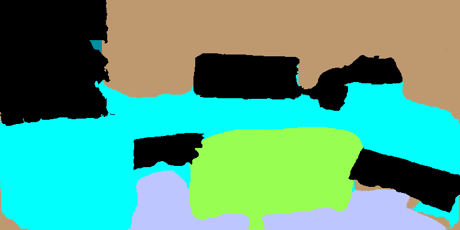

# AdapNet++:  Self-Supervised Model Adaptation for Multimodal Semantic Segmentation
[](https://paperswithcode.com/sota/semantic-segmentation-on-cityscapes?p=self-supervised-model-adaptation-for)
[](https://paperswithcode.com/sota/semantic-segmentation-on-synthia-cvpr16?p=self-supervised-model-adaptation-for)
[](https://paperswithcode.com/sota/semantic-segmentation-on-scannetv2?p=self-supervised-model-adaptation-for)
[](https://paperswithcode.com/sota/semantic-segmentation-on-sun-rgbd?p=self-supervised-model-adaptation-for)
[](https://paperswithcode.com/sota/semantic-segmentation-on-freiburg-forest?p=self-supervised-model-adaptation-for)

AdapNet++ is a compact state-of-the-art deep learning model for semantic image segmentation, where the goal is to assign semantic labels (e.g., car, road, tree and so on) to every pixel in the input image. AdapNet++ is easily trainable on a single GPU with 12 GB of memory and has a fast inference time. AdapNet++ is benchmarked on Cityscapes, Synthia, ScanNet, SUN RGB-D and Freiburg Forest datasets.

This repository contains our TensorFlow implementation of AdapNet++, which allows you to train your own model on any dataset and evaluate results in terms of the mean IoU metric. 

Adapnet++ can further be used with [SSMA](https://github.com/DeepSceneSeg/SSMA) or [CMoDE](https://github.com/DeepSceneSeg/CMoDE) fusion schemes for multimodal semantic segmentation.

If you find the code useful for your research, please consider citing our paper:
```
@article{valada19ijcv,
         author = {Valada, Abhinav and Mohan, Rohit and Burgard, Wolfram},
         title = {Self-Supervised Model Adaptation for Multimodal Semantic Segmentation},
         journal = {International Journal of Computer Vision (IJCV)},
         year = {2019},
         month = {jul},
         doi = {10.1007/s11263-019-01188-y},
         note = {Special Issue: Deep Learning for Robotic Vision},
         issn = {1573-1405},
         day = {08}}
}
```

## Live Demo
http://deepscene.cs.uni-freiburg.de

## Example Segmentation Results

| Dataset       | RGB Image     | Segmented Image|
| :--- | ------------- | -------------  |
| Cityscapes    | |  |
| Forest  |   | |
| Sun RGB-D  |   | |
| Synthia  |   |  |
| ScanNet v2  |   | |

## Contacts
* [Abhinav Valada](http://www2.informatik.uni-freiburg.de/~valada/)
* [Rohit Mohan](https://github.com/mohan1914)

## System Requirements

#### Programming Language
```
Python 2.7
```

#### Python Packages
```
tensorflow-gpu 1.4.0
```

## Configure the Network

* Use checkpoint in init_checkpoint for network intialization
* The initial BN layer of the network learns the appropriate transformation of input data during training. Therefore, no mean subtraction needed.

#### Data
* We use [Image Processing for Basic Depth Completion](https://github.com/kujason/ip_basic) to fill the depth data for all datasets except SUN-RGBD before obtaining the JET colormap or HHA.
* Augment the training data(images and [gt_mapped](https://github.com/DeepSceneSeg/AdapNet-pp/blob/master/images/class_id.txt)).
  In our work, we first resized the images in the dataset to 768x384 pixels and then apply a series of augmentations (random_flip, random_scale and random_crop).

* Convert the training data (augmented), test data and validation data into the .tfrecords format.
  Create a .txt file for each set having entries in the following format:
  ```
     path_to_modality1/0.png path_to_label/0.png
     path_to_modality1/1.png path_to_label/1.png
     path_to_modality1/2.png path_to_label/2.png
     ...
  ```
 Run the convert_to_tfrecords.py from dataset folder for each of the train, test, val sets to create the tfrecords:
  ```
     python convert_to_tfrecords.py --file path_to_.txt_file --record tf_records_name 
  ```
  (Input to model is in BGR and 'NHWC' form)
  
#### Training Params
```
    gpu_id: id of gpu to be used
    model: name of the model
    num_classes: number of classes (including void, label id:0)
    intialize:  path to pre-trained model
    checkpoint: path to save model
    train_data: path to dataset .tfrecords
    batch_size: training batch size
    skip_step: how many steps to print loss 
    height: height of input image
    width: width of input image
    max_iteration: how many iterations to train
    learning_rate: initial learning rate
    save_step: how many steps to save the model
    power: parameter for poly learning rate
```

#### Evaluation Params
```
    gpu_id: id of gpu to be used
    model: name of the model
    num_classes: number of classes (including void, label id:0)
    checkpoint: path to saved model
    test_data: path to dataset .tfrecords
    batch_size: evaluation batch size
    skip_step: how many steps to print mIoU
    height: height of input image
    width: width of input image
```

## Training and Evaluation

#### Training Procedure
Edit the config file for training in config folder.
Run:
```
python train.py -c config\cityscapes_train.config or python train.py --config config\cityscapes_train.config
```

#### Evaluation Procedure

Select a checkpoint to test/validate your model in terms of the mean IoU metric.
Edit the config file for evaluation in config folder. Run:
```
python evaluate.py -c config cityscapes_test.config or python evaluate.py --config cityscapes_test.config
```

## Models
* All the models were trained with the full input_image and labels resized to 768x384 resolution.
* mIoU indicates the single scale evaluation on the val set of each dataset where input_image and labels were resized to 768x384 resolution.
* You can find the class id mappings for the various datasets [here](https://github.com/DeepSceneSeg/AdapNet-pp/blob/master/images/class_id.txt).
* The mIoU of model checkpoints provided might slightly differ from the results reported in the paper.
  
#### Cityscapes (void + 11 classes) 
  | Modality       | mIoU     | 
  | :--- | ------------- |
  | [RGB](http://deepscene.cs.uni-freiburg.de/static/models/cityscapes/adapnet++_cityscapes_rgb.zip) | 80.77 |
  | [Depth](http://deepscene.cs.uni-freiburg.de/static/models/cityscapes/adapnet++_cityscapes_depth.zip) | 65.01 |
  | [HHA](http://deepscene.cs.uni-freiburg.de/static/models/cityscapes/adapnet++_cityscapes_hha.zip) | 67.63 |
  
#### Synthia (void + 11 classes) 
  | Modality       | mIoU     | 
  | :--- | ------------- |
  | [RGB](http://deepscene.cs.uni-freiburg.de/static/models/synthia/adapnet++_synthia_rgb.zip) | 86.68 |
  | [Depth](http://deepscene.cs.uni-freiburg.de/static/models/synthia/adapnet++_synthia_depth.zip) | 87.87 |
  
#### SUN RGB-D (void + 37 classes)
  | Modality       | mIoU     | 
  | :--- | ------------- |
  | [RGB](http://deepscene.cs.uni-freiburg.de/static/models/sun_rgbd/adapnet++_sun_rgb.zip) | 37.98 |
  | [Depth](http://deepscene.cs.uni-freiburg.de/static/models/sun_rgbd/adapnet++_sun_depth.zip) | 34.28 |
  | [HHA](http://deepscene.cs.uni-freiburg.de/static/models/sun_rgbd/adapnet++_sun_hha.zip) | 34.59 |
  
#### ScanNet v2 (void + 20 classes) 
  | Modality       | mIoU     | 
  | :--- | ------------- |
  | [RGB](http://deepscene.cs.uni-freiburg.de/static/models/scannetv2/adapnet++_scannetv2_rgb.zip) | 52.92 |
  | [Depth](http://deepscene.cs.uni-freiburg.de/static/models/scannetv2/adapnet++_scannetv2_depth.zip) | 53.8 |
  | [HHA](http://deepscene.cs.uni-freiburg.de/static/models/scannetv2/adapnet++_scannetv2_hha.zip) | 54.19 |
  
#### Freiburg Forest (void + 5 classes) 
  | Modality       | mIoU     | 
  | :--- | ------------- |
  | [RGB](http://deepscene.cs.uni-freiburg.de/static/models/forest/adapnet++_forest_rgb.zip) | 83.18 |
  | [Depth](http://deepscene.cs.uni-freiburg.de/static/models/forest/adapnet++_forest_depth.zip) | 73.93 |
  | [EVI](http://deepscene.cs.uni-freiburg.de/static/models/forest/adapnet++_forest_evi.zip) | 80.96 |
---
#### Cityscapes (void + 19 classes)
  | Modality       |
  | :--- |
  | [RGB](http://deepscene.cs.uni-freiburg.de/static/models/cityscapes_19/adapnet++_cityscapes_19_rgb.zip) |
  | [HHA](http://deepscene.cs.uni-freiburg.de/static/models/cityscapes_19/adapnet++_cityscapes_19_hha.zip) |
* The model was trained with the crop size of 768x768 and eAspp_rate = [6, 12, 18] 
* mIoU indicates the single scale evaluation on the val set where input_image and labels were of 2048x1024 resolution.
* The mIoU of model checkpoints provided might slightly differ from the results reported in the paper.
---


## Benchmark Results
  * mIoU_val: Evaluation results on the full resolution val set (all semantic classes) as reported by the corresponding methods.
  * mIoU_test: Evaluation results from the benchmarking server on the full resolution test set (all semantic classes).
  * Params: Computed using the official implementation of each method.
  * Time: Inference time computed on an NVIDIA TITAN X (PASCAL) GPU using the official implementation of each method for an input image resolution of 768x384 pixels.

#### [Cityscapes](https://www.cityscapes-dataset.com/benchmarks/#pixel-level-results)
  | Method  | Backbone | mIoU_val (%) | mIoU_test (%) | Params (M) | Time (ms) |
  | :--- | ------------- |------------- | ------------- | ------------- | ------------- |
  |DRN | WideResNet-38 | 79.69 | 82.82 |129.16 | 1259.67 |
  |DPC | Modified Xception | 80.85 | 82.66 | 41.82 | 144.41 |
  |**SSMA** | ResNet-50 | 82.19 | 82.31| 56.44 | 101.95 |
  |DeepLabv3+ | Modified Xception | 79.55 | 82.14 | 43.48 | 127.97 |
  |Mapillary | WideResNet-38 | 78.31 | 82.03 | 135.86 | 214.46 |
  |**Adapnet++** | ResNet-50 | 81.24 | 81.34 | **30.20** | **72.94** |
  |DeepLabv3 | ResNet-101 | 79.30 | 81.34 | 58.16 | 79.90 |
  |PSPNet | ResNet-101 | 80.91 | 81.19 | 56.27 | 172.42 |
  
#### [ScanNet v2](http://kaldir.vc.in.tum.de/scannet_benchmark/semantic_label_2d)
  | Method  | mIoU_test (%) |
  | :--- | ------------- |
  | **SSMA** |     57.7          |
  | FuseNet |     52.1          |
  | **Adapnet++** |       50.3        | 
  | 3DMV (2d proj) |    49.8           | 
  | ILC-PSPNet |      47.5         |

## Additional Notes:
   * We only provide the single scale evaluation script. Multi-Scale+Flip evaluation further imporves the performance of the model.
   * The code in this repository only performs training on a single GPU. Multi-GPU training using synchronized batch normalization with larger batch size further improves the performance of the model.
   * Initializing the model with pre-trained weights from large datasets such as the Mapillary Vistas and BDD100K yields an improved performance.
   
## License
For academic usage, the code is released under the [GPLv3](https://www.gnu.org/licenses/gpl-3.0.en.html) license. For any commercial purpose, please contact the authors.
